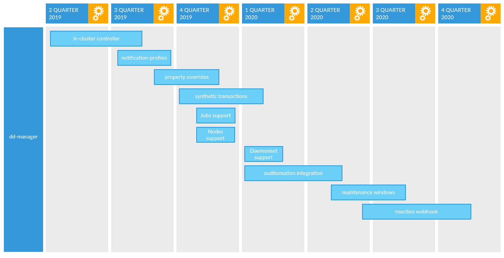

# Roadmap

- in-cluster controller: The initial feature is a controller that runs in a Kubernetes cluster.  Sets of monitors are defined in a yaml configuration file, and are matched to deployments and namespaces based on one or more annotations specified in the config file.  Monitor definitions in the config file can be templated and use properties available in a deployment spec or namespace spec.  As these monitors are generated, they are reconciled with the Datadog api to create, update, or destroy monitors.

- notification profiles: Notification profiles are a defined set of notification endpoints (ie slack channel, pagerduty, etc).  With this feature, notification profiles can be specified and applied independently of monitor definitions.  Notification profiles can be overridden using an annotation on an object.

- property overrides: Properties defined in the monitor configs can be overridden on an object using annotations.

- synthetic transactions: The controller watches ingress objects and creates synthetic transaction monitors.

- jobs support: The controller watches Kubernetes Job objects and creates monitors based on them.

- nodes support: The controller watches Kubernetes node objects and creates monitors based on them.

- daemonset support: The controller watches Kubernetes daemonset objects and creates monitors based on them.

- auditomation integration: The controller reports information to auditomation to enable auditing on monitors.

- reaction webhook: A webhook endpoint is exposed in the cluster that can receive calls from datadog.  When a configured message is received, a script or other action can be run in response.
