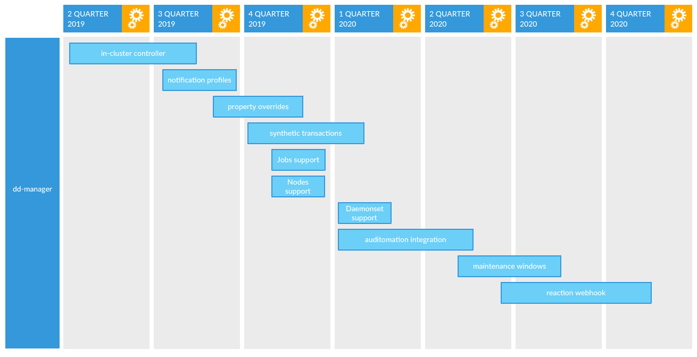

[](https://circleci.com/gh/reactiveops/dd-manager/tree/master)
[](https://codecov.io/gh/reactiveops/dd-manager)


# dd-manager
DD-Manager was designed to simplify datadog monitor administration.  This is an operator that emits datadog monitors based on kubernetes state.  The operator responds to changes of resources in your kubernetes cluster and will manage datadog monitors based on the configured state.

## Configuration
A combination of environment variables and a yaml file is used to configure the application.  An example configuration file is available at [here](conf.yml).

### Environment Variables
| Variable    | Descritpion                        | Required  | Default     |
|:------------|:----------------------------------:|:----------|:------------|
| `DD_API_KEY` | The datadog api key for your datadog account. | `Y` ||
| `DD_APP_KEY` | The datadog app key for your datadog account. | `Y` ||
| `OWNER`      | A unique name to designate as the owner.  This will be applied as a tag to identified managed monitors. | `N`| `dd-manager` |
| `DEFINITIONS_PATH` | The path to the monitor definitions configuration.  This can be a local path or a URL. | `N` | `conf.yml` |
| `DRY_RUN` | when set to true monitors will not be managed in datadog. | `N` | `false` |

### Configuration File
A configuration file is used to define your monitors.  These are organized as rulesets, which consist of the type of resource the ruleset applies to, annotations that must be present on the resource to be considered valid objects, and a set of monitors to manage for that resource.  Go templating syntax may be used in your monitors and values will be inserted from each kubernetes object that matches the ruleset.

```yaml
---
rulesets: 
- type: deployment
  match_annotations:
  - name: dd-manager/owner
    value: dd-manager
  monitors:
    - name: "Deployment Replica Alert - {{ .ObjectMeta.Name }}"
      type: metric alert
      query: "max(last_10m):max:kubernetes_state.deployment.replicas_available{kubernetescluster:foobar,namespace:{{ .ObjectMeta.Namespace }}} by {deployment} <= 0"
      message: |
        {{ "{{#is_alert}}" }}
        Available replicas is currently 0 for {{ .ObjectMeta.Name }}
        {{ "{{/is_alert}}" }}
        {{ "{{^is_alert}}" }}
        Available replicas is no longer 0 for {{ .ObjectMeta.Name }}
        {{ "{{/is_alert}}" }}
      tags: []
      no_data_timeframe: 60
      notify_audit: false
      notify_no_data: false
      renotify_interval: 5
      new_host_delay: 5
      evaluation_delay: 300
      timeout: 300
      escalation_message: ""
      thresholds:
        critical: 0
      require_full_window: true
      locked: false
```

* `rulesets`: (List).  A collection of rulesets.  A ruleset consists of a kubernetes resource type, annotations the resource must have to be considered valid, and a collection of monitors to manage for the resource.
  * `match_annotations`: (List).  A collection of name/value pairs pairs of annotations that must be present on the resource to manage it.
  * `bound_objects`: (List).  A collection of object types that are bound to this object.  For instance, if you have a ruleset for a namespace, you can bind other objects like deployments, services, etc. Then, when the bound objects in the namespace get updated, those rulesets apply to it.
  * `monitors`: (List).  A collection of monitors to manage for any resource that matches the rules defined.
    * `name`: Name of the datadog monitor.
    * `type`: The type of the monitor, chosen from:
      - `metric alert`
      - `service check`
      - `event alert`
      - `query alert`
      - `composite`
      - `log alert`
    * `query`: The monitor query to notify on.
    * `message`: A message included with in monitor notifications.
    * `tags`: A list of tags to add to your monitor.
    * `no_data_timeframe`: Number of minutes before a monitor will notify if data stops reporting.
    * `notify_audit`: boolean that indicates whether tagged users are notified if the monitor changes.
    * `notify_no_data`: boolean that indicates if the monitor notifies if data stops reporting.
    * `renotify_interval`: Number of minutes after the last notification a monitor will re-notify.
    * `new_host_delay`: Number of seconds to wait for a new host before evaluating the monitor status.
    * `evaluation_delay`: Number of seconds to delay evaluation.
    * `timeout`: Number of minutes the before the monitor will automatically resolve if it's not reporting data.
    * `escalation_message`: Message to include with re-notifications.
    * `thresholds`: Map of thresholds for the alert.  Valid options are:
      - `ok`
      - `critical`
      - `warning`
      - `unknown`
      - `critical_recovery`
      - `warning_recovery`
    * `require_full_window`: boolean indicating if a monitor needs a full window of data to be evaluated.
    * `locked`: boolean indicating if changes are only allowed from the creator or admins.

# Development

## Testing
```
go test ./pkg/...
```

### Datadog Mocking
We mock the interface for the Datadog API client library in `./pkg/datadog/datadog.go`.
If you're adding a new function to the interface there, you'll need to regenerate the
mocks using
```
go install github.com/golang/mock/mockgen
mockgen -source=pkg/datadog/datadog.go -destination=pkg/mocks/datadog_mock.go
```

# Roadmap




- in-cluster controller

The initial feature is a controller that runs in a Kubernetes cluster.  Sets of monitors are defined in a yaml configuration file, and are matched to deployments and namespaces based on one or more annotations specified in the config file.  Monitor definitions in the config file can be templated and use properties available in a deployment spec or namespace spec.  As these monitors are generated, they are reconciled with the Datadog api to create, update, or destroy monitors.


- notification profiles

Notification profiles are a defined set of notification endpoints (ie slack channel, pagerduty, etc).  With this feature, notification profiles can be specified and applied independently of monitor definitions.  Notification profiles can be overridden using an annotation on an object.


- property overrides

Properties defined in the monitor configs can be overridden on an object using annotations.


- synthetic transactions

The controller watches ingress objects and creates synthetic transaction monitors.


- jobs support

The controller watches Kubernetes Job objects and creates monitors based on them.


- nodes support

The controller watches Kubernetes node objects and creates monitors based on them.


- daemonset support

The controller watches Kubernetes daemonset objects and creates monitors based on them.


- auditomation integration

The controller reports information to auditomation to enable auditing on monitors.


- reaction webhook

A webhook endpoint is exposed in the cluster that can receive calls from datadog.  When a configured message is received, a script or other action can be run in response.
